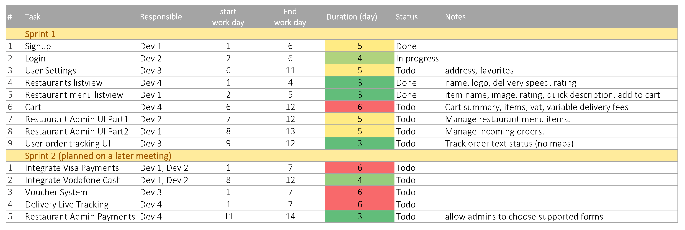

# Sprint Planning 👇

### Part 1 - Scope

**Goal of sprint:**
- Identify important base backlog items to kickstart our project for the first sprint.

**Ready backlog items contributing to current sprint goal:**
- Signup / Login / User settings
- Restaurants list
- Restaurant menu list
- User Cart
- Restaurant Staff/Admin Panel / UI
- User order tracking UI
- Rating system

**Team Availability:**
- All 4 team members.

**Team Capacity:**
- Reviewing team capacity rating feature will be postponed.

Items to include on the sprint backlog based on availabilty of team:
- All except rating system will be postponed to next sprint.

Team is confident that we will finish the required tasks on time.

### Part 2 - Plan:
- planned and identified tasks for each team member in the upcoming table.

