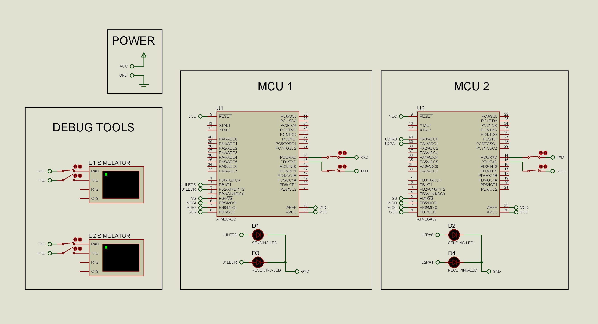

# BCM (Basic Communication Manager)
#### Embedded SW Dynamic Design
#### Author: Hossam Elwahsh

## Brief
> design and implement a BCM (Basic Communication Manager). This module has a
capability to work with different serial communication protocols using ISR with the
highest possible throughput.

## Quick Links
> - `Project Documentation`
    >     👉 [PDF](https://github.com/HossamElwahsh/sprints-automotive/blob/cecb5c2abcbae1fcaac1a3a8283f19a8ed6262c7/Embedded%20SW%20Design/S_DYNAMIC_08%20Implement%20a%20BCM/shared/Documents/BCM_Hossam_Elwahsh.pdf)
    >     👉 [Google Docs](https://docs.google.com/document/d/1RGJPeiUToRLG9_xMESDV1yPxoA4-tSaAatRC9MfRurg/edit?usp=sharing)
> - `Video` 👉 In Progress
> - ---
> ### Technical
> - `Proteus Simulation (Proteus 8.13)` 👉 [BCM.pdsprj](Simulation/BCM.pdsprj)
> #### for older proteus version you can import the proteus clip file (pdsclip) and update the MC hex file:
> - `Proteus clip file` 👉 [BCM.pdsclip](Simulation/BCM.pdsclip)
> - `MCU1 Hex` 👉 [MCU1.hex](Simulation/MCU1.hex)
> - `MCU2 Hex` 👉 [MCU2.hex](Simulation/MCU2.hex)

---------

## Circuit Schematic

