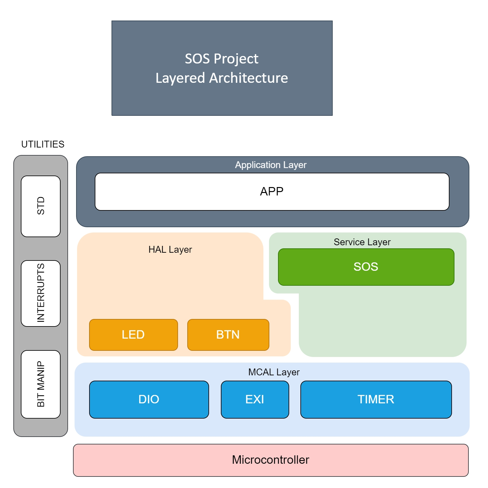

# Small OS Design
#### Embedded SW Dynamic Design
#### Author: Hossam Elwahsh

## Brief
> You are required to design a small OS with a priority based preemptive scheduler based
on time-triggered.

## Quick Links
> - `Project Documentation`
    >     👉 [PDF](Small%20Operating%20System%20Design%20-%20Hossam%20Elwahsh.pdf)
    >     👉 [Google Docs](https://docs.google.com/document/d/1bOCz5Sd4_1kropvjwwozYFeMRyH5x1e0L_45VlRoyQo/edit?usp=sharing)
> - `Video` 👉 [Youtube](https://youtu.be/KJ__WUkRSWo)

---------

## Layered Architecture

