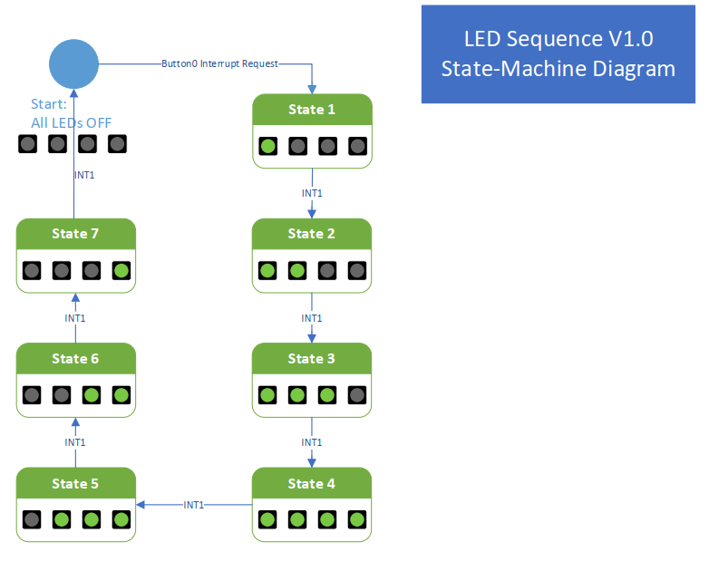

# Embedded Systems - Level 1
### Author: Hossam Elwahsh
## LED Sequence V1.0

## Quick Links
- `Project PDF` -> [LED Sequence V1.0 - Design.pdf](Docs/LED%20Sequence%20V1.0%20-%20Design.pdf)
- `Overview + Unit-testing video` -> [Youtube - LED  Sequence V1.0](https://youtu.be/qt29NOkojkU)
- `Proteus Project` in `Proteus` Folder
- `Project Hex` in `Proteus/Led Sequence V1.0.hex` [View](Proteus/Led%20Sequence%20V1.0.hex)
- `Download full project` -> [Download](https://download-directory.github.io?url=https://github.com/HossamElwahsh/sprints-automotive/tree/main/Embedded_Systems_Level_1/2_S_ESL1_02%20LED%20sequence%20V1.0)

### Requirements
#### Develop a system that controls 4 LEDs lighting sequence according to button pressing.

### 1. System Requirements Specifications
#### 1.1. Hardware Requirements
                Four LEDs (LED0, LED1, LED2, LED3)
                One button (BUTTON0)
#### 1.2. Software Requirements
                Initially, all LEDs are OFF
                Once BUTTON0 is pressed, LED0 will be ON
                Each press further will make another LED is ON
                At the fifth press, LED0 will changed to be OFF
                Each press further will make only one LED is OFF
                This will be repeated forever
                The sequence is described below 
                    Initially (OFF, OFF, OFF, OFF)
                    Press 1 (ON, OFF, OFF, OFF)
                    Press 2 (ON, ON, OFF, OFF)
                    Press 3 (ON, ON, ON, OFF)
                    Press 4 (ON, ON, ON, ON)
                    Press 5 (OFF, ON, ON, ON)
                    Press 6 (OFF, OFF, ON, ON)
                    Press 7 (OFF, OFF, OFF, ON)
                    Press 8 (OFF, OFF, OFF, OFF)
                    Press 9 (ON, OFF, OFF, OFF)
---------

## App State Machine Diagram


## Project Tree

### Full Diagrams and Design PDF can be found in `DOCS` folder  
```
├───Docs
│       *.vsdx
│       LED Sequence V1.0 - Design.pdf -> Design PDF
```

### Full Project Tree

```
D:.
│   .gitignore
│   main.c
│   main.h
│   README.md
│       
├───Application
│       application.c
│       application.h
│
├───Common
│       bit_manipulation.h
│       types.h
│
├───Docs
│       *.vsdx -> All diagrams VISIO files
│       LED Sequence V1.0 - Design.pdf -> Design PDF
│       StateMachine.vsdx
│
├───ECUAL
│   ├───Button Driver
│   │       button.c
│   │       button.h
│   │
│   └───LED Driver
│           led.c
│           led.h
│
├───MCAL
│   │   registers.h
│   │
│   ├───DIO Driver
│   │       dio.c
│   │       dio.h
│   │
│   └───EXI Driver
│           interrupts.c
│           interrupts.h
│
├───Proteus
│       Proteus_LED_Sequence_V1.0.pdsprj
```