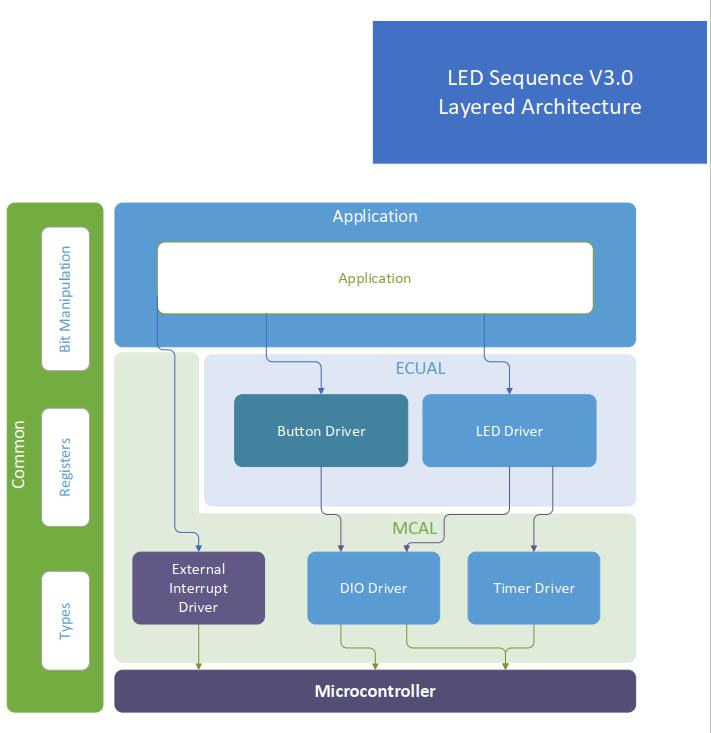

# Embedded Systems - Level 1
### Author: Hossam Elwahsh
## LED Sequence V3.0

## Quick Links
- `Project PDF` -> [LED Sequence V3.0 - Design.pdf](Docs/LED%20Sequence%20V3.0%20-%20Design.pdf)
- `Proteus Project` in `Proteus` Folder
- `Project Hex` in `Proteus/Led Sequence V3.0.hex` [View](Proteus/Led%20Sequence%20V3.0.hex)
- `Download full project` -> [Download](https://download-directory.github.io/?url=https://github.com/HossamElwahsh/sprints-automotive/tree/main/Embedded_Systems_Level_1/3_S_ESL1_03%20-%20LED%20sequence%20V3.0)

### Requirements
#### Develop a system that controls 4 LEDs lighting sequence according to button pressing. (USE EXTERNAL INTERRUPTS)

### 1. System Requirements Specifications
#### 1.1. Hardware Requirements
                Four LEDs (LED0, LED1, LED2, LED3)
                Two buttons (BUTTON0 and BUTTON1)
#### 1.2. Software Requirements
    Initially, all LEDs are OFF
    Once BUTTON0 is pressed, LED0 will blink with BLINK_1 mode
    Each press further will make another LED blinks BLINK_1 mode
    At the fifth press, LED0 will changed to be OFF
    Each press further will make only one LED is OFF

    This will be repeated forever
    The sequence is described below 
        Initially (OFF, OFF, OFF, OFF)
        Press 1 (BLINK_1, OFF, OFF, OFF)
        Press 2 (BLINK_1, BLINK_1, OFF, OFF)
        Press 3 (BLINK_1, BLINK_1, BLINK_1, OFF)
        Press 4 (BLINK_1, BLINK_1, BLINK_1, BLINK_1)
        Press 5 (OFF, BLINK_1, BLINK_1, BLINK_1)
        Press 6 (OFF, OFF, BLINK_1, BLINK_1)
        Press 7 (OFF, OFF, OFF, BLINK_1)
        Press 8 (OFF, OFF, OFF, OFF)
        Press 9 (BLINK_1, OFF, OFF, OFF)

    When BUTTON1 has pressed the blinking on and off durations will be changed
        No press → BLINK_1 mode (ON: 100ms, OFF: 900ms)
        First press → BLINK_2 mode (ON: 200ms, OFF: 800ms)
        Second press → BLINK_3 mode (ON: 300ms, OFF: 700ms)
        Third press → BLINK_4 mode (ON: 500ms, OFF: 500ms)
        Fourth  press → BLINK_5 mode (ON: 800ms, OFF: 200ms)
        Fifth press → BLINK_1 mode
    USE EXTERNAL INTERRUPTS
---------

## App Layered Architecture


## App State Diagram


## Circuit Diagram


## Project Tree

### Full Diagrams and Design PDF can be found in `DOCS` folder  
```
├───Docs
│       *.vsdx
│       LED Sequence V3.0 - Design.pdf -> Design PDF
```

### Full Project Tree

```
D:.
│   .gitignore
│   main.c
│   main.h
│   README.md
│       
├───Application
│       application.c
│       application.h
│
├───Common
│       bit_manipulation.h
│       types.h
│
├───Docs
│       *.vsdx -> All diagrams VISIO files
│       LED Sequence V3.0 - Design.pdf -> Design PDF
│       StateMachine.vsdx
│
├───ECUAL
│   ├───Button Driver
│   │       button.c
│   │       button.h
│   │
│   └───LED Driver
│           led.c
│           led.h
│
├───MCAL
│   │   registers.h
│   │
│   ├───DIO Driver
│   │       dio.c
│   │       dio.h
│   │
│   └───EXI Driver
│           interrupts.c
│           interrupts.h
│
├───Proteus
│       Proteus_LED_Sequence_V3.0.pdsprj
```